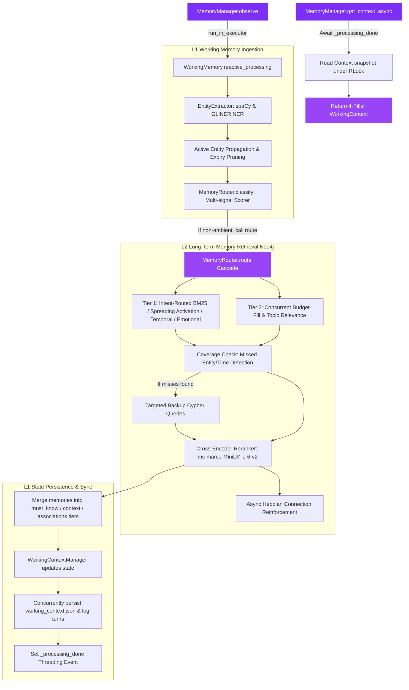

<div align="center">
  
  
  <br/>

  [](https://git.io/typing-svg)

  <br/>

  [](https://zafar-dev-portfolio.vercel.app/)
  &nbsp;
  [](https://www.linkedin.com/in/md-zafar-41687b157)
  &nbsp;
  [](mailto:mdzafarddd@gmail.com)

  <br/><br/>
  
  
  &nbsp;
  

</div>

---

## 👨‍💻 Engineering Philosophy

I build software systems that solve real problems. My focus bridges the gap between **robust system design**, **highly-efficient web automation**, and **applied artificial intelligence**. I don't just build chatbots or basic CRUD interfaces—I design multi-tenant SaaS structures with fine-grained access isolation, architect microservice pipelines to scrape and orchestrate complex datasets, and build custom cognitive memory infrastructures for agentic AI applications.

---

## 🛠️ Tech Stack Matrix

| Domain | Technologies |
| :--- | :--- |
| **Languages** | `Python` &middot; `TypeScript` &middot; `JavaScript` &middot; `HTML/CSS` &middot; `C` |
| **Backend & Web APIs** | `FastAPI` &middot; `Flask` &middot; `Node.js` &middot; `REST APIs` &middot; `Microservices` |
| **Frontend & Mobile** | `Next.js` &middot; `React` &middot; `React Native` &middot; `Tailwind CSS` |
| **AI/ML & Cognitive Systems** | `LangChain` &middot; `RAG Pipelines` &middot; `Neo4j` &middot; `spaCy` &middot; `GLiNER` &middot; `OpenCV` &middot; `scikit-learn` &middot; `Hugging Face` |
| **Databases & Infrastructure** | `PostgreSQL` &middot; `MongoDB` &middot; `SQLite` &middot; `Docker` &middot; `Linux` &middot; `Git/GitHub` |

---

## 🏗️ Architectural Showcases

These architectural showcases outline the systems design and technical approaches behind my core builds.

### [🧠 Showcase A: Three-Tier Cognitive AI Memory (assistant-memory)](https://github.com/zafar-TechWizard/Assistant-Memory-System)
A production-grade Python library providing a three-tier cognitive memory architecture (L1 Working Memory, L2 Neo4j Graph, and background extraction/consolidation pipelines) to supply agents with human-like recall.



*   **L1 Working Memory**: Processes message text concurrently. Extracts entities via spaCy (sliding-window NER) and GLiNER (zero-shot concepts), maintains entity propagation, and manages short-term conversational context.
*   **L2 Neo4j Graph Storage**: Maps memories as nodes (`ExperienceMemory`, `KnowledgeMemory`, `RelationshipMemory`) linked by weighted semantic edges (`CAUSED`, `TEMPORAL`, etc.) instead of flat vector indexes.
*   **Intent-Routed Spreading Activation**: Uses pre-compiled regex scoring to classify queries into five intents (`entity`, `factual`, `emotional`, `temporal`, `ambient`), traversing specific paths with intent-boosted conductivity.
*   **Agentic Consolidation**: An asynchronous background loop that uses an LLM to reason over conversation history, merging duplicates and resolving contradictory beliefs while preserving temporal lineage.
*   **Safe Sync Gate**: Ensures context-retrieval gates block on a thread-safe `_processing_done` event, ensuring fresh contexts are generated without starving async IO database calls.

---

### [🤖 Showcase B: Agentic Loop & Coordinator Core (SOFI)](https://github.com/zafar-TechWizard/SOFI)
A personalized agentic AI assistant orchestrating sub-agents, inline/background tool execution, and local-first workspace monitoring.

```mermaid
graph TD
    User([User Turn]) --> Input[sofi.py / CLI]
    Input --> Process[Brain.process]
    
    %% Preparation Phase
    subgraph Context & Mode Selection
        Process --> ObserveL1[MemoryManager.observe user input]
        ObserveL1 --> StateInfer[UserStateInferencer: Emotional State & Focus]
        StateInfer --> ModeDecide[ModeController: Conversational / Focused / Creative / Empathetic]
    end

    %% System Prompt Building
    ModeDecide --> BuildPrompt[Prompt Builder: Persona + Skills + Agent Notes + Active Workspace Tasks]
    
    %% LLM Execution Cascade
    BuildPrompt --> LLMLoop{LLM Response Loop}
    
    subgraph Agentic Execution Loop
        LLMLoop -->|Tool Call| SafetyGate{Safety Gate: User Confirmation}
        SafetyGate -->|Approved Inline| InlineExec[Inline Execution: Parallel asyncio.gather]
        SafetyGate -->|Approved Background| BgExec[BackgroundManager.dispatch]
        InlineExec --> ToolMsg[Append Tool Results to History]
        BgExec --> Ack[Yield "On it" Acknowledgment & Exit]
        ToolMsg --> LLMLoop
        
        LLMLoop -->|Final Text| Stream[Stream Response Tokens to User]
    end

    %% Post Turn bookkeeping
    Stream --> Finalize[Brain._finalize_turn]
    Finalize --> ObserveL2[MemoryManager.observe assistant response]
    Finalize --> AgentMem[AgentMemoryManager: Update persistent notes]

    style User fill:#7B2FF7,stroke:#fff,stroke-width:2px,color:#fff
    style LLMLoop fill:#9745F5,stroke:#fff,stroke-width:2px,color:#fff
    style Stream fill:#7B2FF7,stroke:#fff,stroke-width:2px,color:#fff
    style BgExec fill:#1F2937,stroke:#7B2FF7,stroke-width:2px,color:#fff
    style ObserveL2 fill:#1F2937,stroke:#9745F5,stroke-width:2px,color:#fff
```

*   **Turn-Based Coordination**: Drives the agentic loop, feeding user inputs into the memory engine, inferring user emotional state, and dynamically deciding operational modes (`CONVERSATIONAL`, `FOCUSED`, `CREATIVE`, `EMPATHETIC`).
*   **Dynamic Prompt Ingestion**: Compiles system instructions by binding persona guidelines, active tool/skill definitions, persistent Markdown agent memory notes, and pending workspace statuses.
*   **Hybrid Execution & Safety Gate**: Safety gates filter tool calls requiring explicit authorization. Inline execution is executed in parallel, while long-running background tasks are dispatched to a `BackgroundManager`.
*   **Non-Blocking Tool Call Ack**: Immediately yields inline acknowledgments (e.g. "On it.") for background dispatches, continuing conversation flow while monitoring background tasks in the subsequent turn's action state.
*   **Compacting & Budget Control**: Monitors session token usage, compacting older conversation details into summary blocks to ensure context boundaries fit prompt limitations.

---

## 📂 Under-The-Hood Projects

Here are some other systems, prototypes, and experiments I've built during my development journey:

<details>
<summary><b>📱 SOFI-App (React Native Mobile Interface)</b></summary>

*   A React Native (TypeScript) mobile application that acts as a secure, real-time control interface for interacting with my personal assistant.
</details>

<details>
<summary><b>🔍 InfoLytix (Search RAG Engine)</b></summary>

*   A Perplexity-like research assistant that rewrites searches, crawls target web documents in real-time, reranks snippets using a cross-encoder model, and generates cited, grounded answers.
</details>

<details>
<summary><b>📅 StudySync (Android Excel Schedule Parser)</b></summary>

*   An utility application built to solve schedule drift. It downloads university Excel timetables, filters them dynamically based on user sections and batch details, and sets local alarm managers to notify about classes, venues, and teachers 15 minutes before they begin.
</details>

<details>
<summary><b>🧘 ZenPulse (Flask Wellness Companion)</b></summary>

*   A mental well-being dashboard built using Flask, containing a session-isolated LLM chatbot for emotional support and a virtual chatbot pet that responds dynamically to user text input.
</details>

<details>
<summary><b>🏢 CoWork Pro (Coworking Space SaaS)</b></summary>

*   A coworking space management platform showcasing Next.js & FastAPI, PostgreSQL schema isolation, role/location access rules, and automated browser automation microservices.
</details>

<details>
<summary><b>📊 Applied Machine Learning & Data Science</b></summary>

*   **Real-Time Surveillance**: CV model employing deep learning to classfy threat types in live video feeds and trigger automated SMTP alerts. (Startup Thrive Hackathon Top 4).
*   **Animal Species Classification**: CV model employing deep transfer learning to categorize animal classes.
*   **Age & Gender Detection**: Computer vision model wrapped in a Streamlit GUI to perform live/image-based face classification.
*   **Car Price Prediction**: Regression analysis model evaluating pre-owned vehicle valuations.
*   **Email Spam Classifier**: NLP text classification model identifying and filtering spam emails.
*   **Movie Recommendation System**: Similarity-search-based recommendation engine utilizing collaborative vector filtering.
</details>

---

## 📊 Developer Metrics

<div align="center">
  
  &nbsp;&nbsp;
  
  
  <br/>
  
  

  <br/>
  
  
</div>

---

## 🚀 Currently & Connecting

```yaml
learning:
  - Advanced distributed system design & concurrency
  - Custom LLM fine-tuning & domain-specific embeddings
  - Cloud-native architecture (AWS certification track)
building:
  - Local-first knowledge systems and custom agent integrations
  - Production SaaS models with isolation-first constraints
open_to:
  - Contract & freelance system builds (FastAPI backend architectures, RAG, Web Automation)
  - Collaborative engineering in agentic and developer tooling projects
```

<div align="center">
  
  
  <br/>
  
  
</div>
