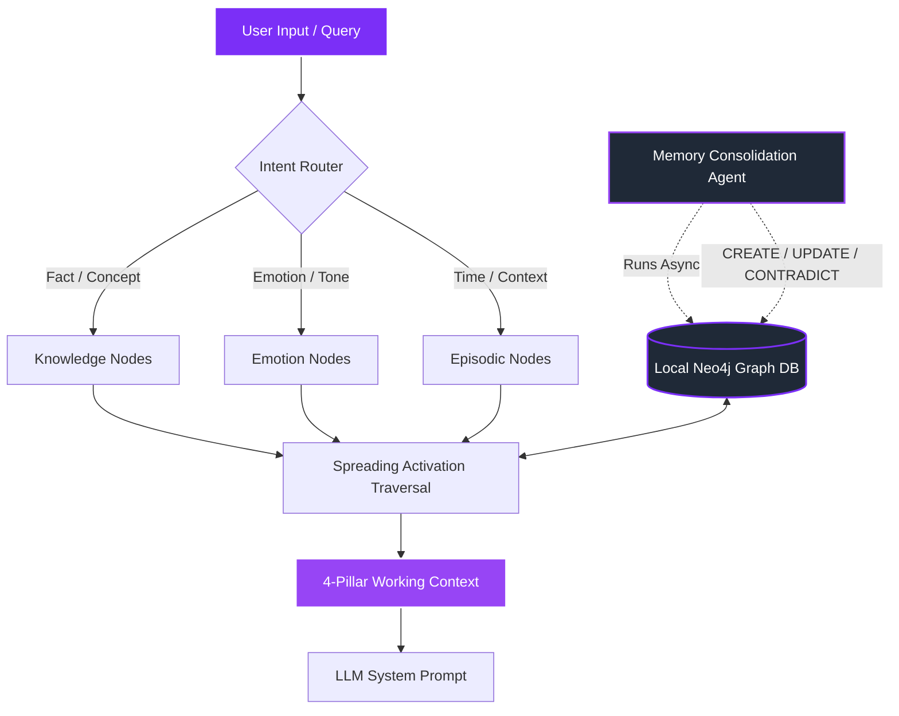
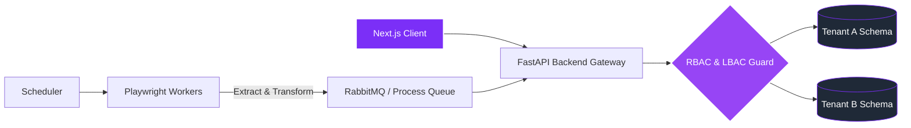
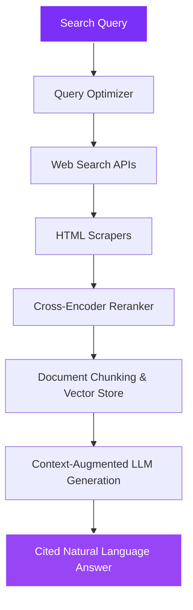

<div align="center">
  
  
  <br/>

  [](https://git.io/typing-svg)

  <br/>

  [](https://zafar-dev-portfolio.vercel.app/)
  &nbsp;
  [](https://www.linkedin.com/in/md-zafar-41687b157)
  &nbsp;
  [](mailto:mdzafarddd@gmail.com)

  <br/><br/>
  
  
  &nbsp;
  

</div>

---

## 👨‍💻 Engineering Philosophy

I build software systems that solve real problems. My focus bridges the gap between **robust system design**, **highly-efficient web automation**, and **applied artificial intelligence**. I don't just build chatbots or basic CRUD interfaces—I design multi-tenant SaaS structures with fine-grained access isolation, architect microservice pipelines to scrape and orchestrate complex datasets, and build custom cognitive memory infrastructures for agentic AI applications.

---

## 🛠️ Tech Stack Matrix

| Domain | Technologies |
| :--- | :--- |
| **Languages** | `Python` &middot; `TypeScript` &middot; `JavaScript` &middot; `HTML/CSS` &middot; `C` |
| **Backend & Web APIs** | `FastAPI` &middot; `Flask` &middot; `Node.js` &middot; `REST APIs` &middot; `Microservices` |
| **Frontend & Mobile** | `Next.js` &middot; `React` &middot; `React Native` &middot; `Tailwind CSS` |
| **AI/ML & Cognitive Systems** | `LangChain` &middot; `RAG Pipelines` &middot; `Neo4j` &middot; `spaCy` &middot; `GLiNER` &middot; `OpenCV` &middot; `scikit-learn` &middot; `Hugging Face` |
| **Databases & Infrastructure** | `PostgreSQL` &middot; `MongoDB` &middot; `SQLite` &middot; `Docker` &middot; `Linux` &middot; `Git/GitHub` |

---

## 🏗️ Architectural Showcases

These architectural showcases outline the systems design and technical approaches behind my core builds.

### 🧠 Showcase A: Three-Tier Cognitive AI Memory (`assistant-memory`)
An open-source, modular Python library that gives AI agents a cognitive memory system inspired by the human brain—moving beyond simple vector retrieval to intent-aware graph traversal.



*   **Semantic Graph Traversals**: Implemented spreading-activation retrieval using Neo4j to find linked memories based on conversational context, preventing topic-drift.
*   **Intent-Aware Routing**: Boosts different memory edges dynamically based on whether the query is factual (knowledge-path), temporal (chronological-path), or emotional.
*   **Agentic Consolidation**: An asynchronous reasoning loop that parses past interactions, updates graph entities, and explicitly handles conflicting beliefs over time without destroying historic lineage.
*   **Zero Vendor Lock-In**: Operates locally using dockerized Neo4j, sentence embeddings, and local cross-encoder rerankers, requiring zero external SaaS bills.

---

### 🏢 Showcase B: Multi-Tenant SaaS & Data Pipelines (`CoWork-Pro`)
A coworking space management platform built to scale, showcasing multi-tenant Postgres schema isolation, role/location access rules, and automated browser automation microservices.



*   **Granular Tenancy Security**: Architected robust schema-level data separation with Role-Based Access Control (RBAC) and Location-Based Access Control (LBAC) to handle secure corporate bookings and billing.
*   **Browser Automation Microservices**: Designed self-healing automated pipelines using Playwright to extract, sanitize, and update external resource availabilities into database records.
*   **Scalable Stack**: Combines a fast-loading React/Next.js frontend with an asynchronous FastAPI gateway executing optimized PostgreSQL transactions.

---

### 🔍 Showcase C: Search RAG & Real-Time Computer Vision (`InfoLytix` & `Surveillance`)
Applied AI implementations focused on real-time data retrieval and processing, bridging the gap between web databases and computer vision models.



*   **Multi-Step RAG Pipeline (`InfoLytix`)**: A Perplexity-like research assistant that rewrites searches, crawls target web documents in real-time, reranks snippets, and generates cited, grounded answers.
*   **Real-Time CV Surveillance**: Built a computer vision threat detection prototype during the Startup Thrive Hackathon (Top 4 Finish) that processes video streams concurrently and dispatches automated SMTP alert notifications.

---

## 📂 Under-The-Hood Projects

Here are some other systems, prototypes, and experiments I've built during my development journey:

<details>
<summary><b>📱 SOFI-App & AI Agent Ecosystem</b></summary>

*   **SOFI**: My personal agentic assistant utilizing sub-agent structures, memory tools, and the `assistant-memory` engine to run background processes.
*   **SOFI-App**: A React Native (TypeScript) mobile application that acts as a secure, real-time control interface for interacting with my personal assistant.
</details>

<details>
<summary><b>📅 StudySync (Android Excel Schedule Parser)</b></summary>

*   An utility application built to solve schedule drift. It downloads university Excel timetables, filters them dynamically based on user sections and batch details, and sets local alarm managers to notify about classes, venues, and teachers 15 minutes before they begin.
</details>

<details>
<summary><b>🧘 ZenPulse (Flask Wellness Companion)</b></summary>

*   A mental well-being dashboard built using Flask, containing a session-isolated LLM chatbot for emotional support and a virtual chatbot pet that responds dynamically to user text input.
</details>

<details>
<summary><b>📊 Applied Machine Learning & Data Science</b></summary>

*   **Animal Species Classification**: CV model employing deep transfer learning to categorize animal classes.
*   **Age & Gender Detection**: Computer vision model wrapped in a Streamlit GUI to perform live/image-based face classification.
*   **Car Price Prediction**: Regression analysis model evaluating pre-owned vehicle valuations.
*   **Email Spam Classifier**: NLP text classification model identifying and filtering spam emails.
*   **Movie Recommendation System**: Similarity-search-based recommendation engine utilizing collaborative vector filtering.
</details>

---

## 📊 Developer Metrics

<div align="center">
  
  &nbsp;&nbsp;
  
  
  <br/>
  
  

  <br/>
  
  
</div>

---

## 🚀 Currently & Connecting

```yaml
learning:
  - Advanced distributed system design & concurrency
  - Custom LLM fine-tuning & domain-specific embeddings
  - Cloud-native architecture (AWS certification track)
building:
  - Local-first knowledge systems and custom agent integrations
  - Production SaaS models with isolation-first constraints
open_to:
  - Contract & freelance system builds (FastAPI backend architectures, RAG, Web Automation)
  - Collaborative engineering in agentic and developer tooling projects
```

<div align="center">
  
  
  <br/>
  
  
</div>
